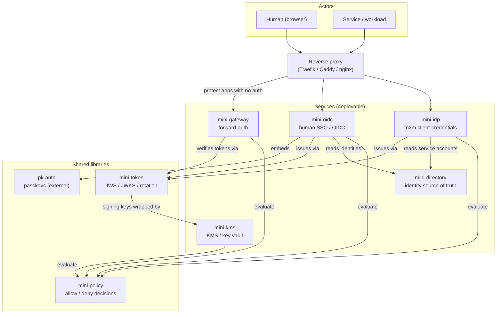

# mini-auth — Direction

This is the canonical direction document for the **mini-** family: what it is, what each
piece does, how the pieces fit together, and where it is going. If you read one file to
understand the whole, read this one.

> This is a living design doc, not an API reference. Each shipping service documents its own
> contract in its own `README.md` / OpenAPI spec; this doc is about the *whole*.

## Table of contents

- [Vision & ethos](#vision--ethos)
- [The component catalog](#the-component-catalog)
- [System architecture](#system-architecture)
- [Runtime relationships (what the names don't show)](#runtime-relationships)
- [Wrapping the signing keys under mini-kms](#wrapping-the-signing-keys-under-mini-kms)
- [Resolved design decision: the client registry folded into mini-directory](#resolved-design-decision-the-client-registry-folded-into-mini-directory)
- [Toward a mini-common library](#toward-a-mini-common-library)
- [Roadmap](#roadmap)
- [Build aggregation](#build-aggregation)

---

## Vision & ethos

mini-auth is the umbrella for a family of small auth/identity services built in the same
spirit as **mini-kms** and **mini-idp**: **educational, but homelab-functional.** The code is
meant to be *read* — heavily commented, JDK-first, real-but-un-audited crypto — and at the same
time actually run a small self-hosted setup.

The guiding principle is **many small, single-responsibility libraries composed into a few
deployable services.** A "mini" is either a *library* (a focused piece of machinery: a token
plane, a policy decision function) or a *service* (a deployable front door: an OpenID Provider,
a forward-auth gateway). Services are thin; they wire libraries together and add a transport.

mini-auth itself does **not re-implement** what mini-kms and mini-idp already do. It is two
things:

1. **An aggregator build** — a single `./gradlew build` that builds the whole family, existing
   services included, in place.
2. **This direction doc** — the shared map the individual repos can't carry on their own.

The values inherited from the existing repos are non-negotiable across the family:

- **`core` stays I/O-free.** Crypto and domain logic never import a transport.
- **No oracles, no secret leakage.** Auth failures collapse to one generic error; secrets,
  keys, and bodies are never logged.
- **Secrets via env/file, never argv.** Constant-time comparisons. At-rest files `0600`,
  written atomically.
- **Loopback by default.** Exposing anything beyond loopback is an explicit operator decision.
- **One toolchain.** JDK 21, Kotlin-DSL Gradle, and one shared version catalog — the same
  **Jackson 3.x** (`tools.jackson.*`), Bouncy Castle, and JUnit versions everywhere.

---

## The component catalog

Every mini, its one-line purpose, whether it is a library or a service, and its status.

| Mini | Purpose | Type | Status |
| --- | --- | --- | --- |
| **mini-kms** | Envelope encryption / KMS: rotatable keys, the eventual vault that wraps other services' signing keys. | service (+ core/client libs) | **shipping** |
| **mini-idp** | Machine-to-machine identity: OAuth2 client-credentials → Ed25519 JWT, JWKS. | service (+ core lib) | **shipping** |
| **mini-token** | The shared token plane: JWS, JWKS, signing-key lifecycle, rotation, revocation, audit, the `grants` claim contract, a persistence SPI, the offline `JwsClaimsVerifier`, AND the shared browser-SSO `SessionService` (so mini-oidc and mini-gateway share one session store). | library | **shipping** |
| **mini-policy** | Generalized authorization decision function: `(principal, action, resource) → allow/deny`. Generalizes mini-kms's `KeyAuthorizationPolicy`. | library | **shipping** (minimal engine; consumed by directory/oidc/gateway/kms — family-wide grant sourcing is future) |
| **mini-oidc** | Human SSO / OpenID Provider: authorization-code + PKCE, ID + access + refresh tokens, /userinfo, browser SSO sessions, single logout, login/consent UI. Embeds **pk-auth** (passkeys + backup-code recovery), mints via **mini-token**, authorizes scopes via **mini-policy**, resolves users from **mini-directory**. | service | **shipping** |
| **mini-gateway** | Forward-auth endpoint for a reverse proxy (Traefik / Caddy / nginx `auth_request`) to gate apps with no native auth: validates the shared mini-oidc SSO session or a bearer token, decides per-route via mini-policy, returns allow / 401 / 403 / redirect-to-login. | service | **shipping** |
| **mini-directory** | The single identity source of truth: humans, groups, roles, service accounts, and their grant mappings; resolves any account to a mini-policy `Principal` + expanded grants. | service | **shipping** (standalone; issuers not yet wired to read from it) |
| **pk-auth** | Passkeys-first auth library set, published on Maven Central under `com.codeheadsystems`. Consumed as a normal dependency — **not vendored**. | external library | **shipping (external)** |
| **mini-ca** | Small internal certificate authority for mTLS between the minis and workload identity in the homelab. Issues/renews short-lived leaves from CSRs; its CA key is wrapped under mini-kms. | service (application) | **shipping** |
| **mini-console** | Optional unified admin UI over the family. | service (future) | **roadmap** (placeholder module) |

"Scaffolded" means: a correct module that **compiles and passes a trivial test**, with the real
protocol/crypto left as clearly-marked TODOs at the seams. It is deliberately *not* a half-built
service that looks finished.

---

## System architecture

Two kinds of actor reach the family through a reverse proxy; services lean on the shared
libraries; the libraries lean (recursively) on mini-kms.



- **Actors → reverse proxy.** Humans arrive with a browser; services arrive with client
  credentials. The proxy is the single ingress.
- **Reverse proxy → services.** The proxy routes login to mini-oidc, token issuance to mini-idp,
  and — for apps that have *no* auth of their own — defers the allow/deny to mini-gateway via a
  forward-auth subrequest.
- **Services → shared libraries.** Services are thin compositions over the libraries.
- **Libraries → mini-kms.** The token plane's signing keys are ultimately wrapped by mini-kms,
  closing the loop.

---

## Runtime relationships

The names alone don't reveal how the pieces actually depend on each other at runtime. These are
the load-bearing relationships:

- **mini-oidc embeds pk-auth.** The passkey registration/login ceremonies are *not* re-invented;
  mini-oidc depends on `com.codeheadsystems:pk-auth-core` from Maven Central and drives it as its
  credential layer. pk-auth is never vendored into this repo.
- **mini-oidc and mini-idp both issue through mini-token.** Two different front doors — humans vs.
  machines — but **one** token plane underneath: the same JWS issuance, the same JWKS publication,
  the same signing-key rotation/revocation/audit. mini-token is the extraction of the machinery
  mini-idp wrote first, so the two issuers stop diverging.
- **All services evaluate through mini-policy.** mini-gateway gating a route, mini-kms gating a
  key group, the issuers checking a scope — each becomes a `PolicyRequest(principal, resource,
  action)` against one engine. mini-policy is the generalization of mini-kms's
  `KeyAuthorizationPolicy`.
- **mini-token's signing keys are wrapped by mini-kms (the recursive integration — *done*).** The
  default educational path still stores the Ed25519 private key locally (`0600`), but with the
  `--kms-*` config the auth services wrap each signing key under a mini-kms key group: only the
  envelope ciphertext touches disk, and the key is unwrapped in memory at use. So the token plane
  that issues identity tokens has its own signing keys protected by another mini — the family
  secures itself. This is the single most important relationship in the design; its mechanics and
  bootstrap ordering are detailed in [Wrapping the signing keys under mini-kms](#wrapping-the-signing-keys-under-mini-kms) below.
- **mini-directory is the identity source of truth that mini-oidc and mini-idp read.** Instead of
  each issuer keeping a private registry, both resolve principals and grants from mini-directory:
  mini-oidc resolves human users, mini-idp resolves service accounts. The grants it stores are the
  data mini-policy decisions are evaluated against.

The claim payload already lines up across the family. A mini-idp token's `grants` claim maps
directly onto mini-kms's authorization model (`sub → Principal.id`, `grants.control →
Principal.admin`, `grants.groups[] → KeyAuthorizationPolicy`). mini-token preserves that mapping;
mini-policy is where it is evaluated; mini-directory is where the grants originate.

> **Wired vs. designed — read this before tracing the token → mini-kms path.** The mapping above is
> the *designed* contract, and the verifier half (`GrantsClaim.toAuthorization()`) exists — but it is
> **not yet the live runtime path**. Today mini-kms authenticates callers with a shared per-plane
> bearer token and two fixed principals (`KmsRequestHandler`); it does not parse a JWT or consume a
> `grants` claim, and ships `AllowAllPolicy` on the data plane. So a learner who picks this headline
> relationship to trace through running code will not find the bridge — it is a documented future
> seam, not current behavior. **What is wired today:** mini-directory → mini-oidc/mini-idp identity
> resolution; mini-policy decisions inside mini-oidc (scopes) and mini-gateway (routes); and the
> recursive `KmsSigningKeyStore` key-wrapping. The token → mini-kms *authorization* step is the
> outstanding integration (see the roadmap).

---

## Wrapping the signing keys under mini-kms

The token plane signs with Ed25519 private keys. By default those keys live in
`signing-keys.json` (atomic, `0600`) in the clear — the readable, no-extra-moving-parts educational
path. Switch on the **mini-kms-backed key store** and the same keys are envelope-encrypted under a
mini-kms key group: **no plaintext signing key ever touches disk.**

### How it works

mini-token's key-at-rest seam is the `store/DocumentStore<SigningKeys>` SPI. There are two
implementations:

- **Default** — each service's atomic-`0600` `JsonStore` writes the `SigningKeys` document with the
  private key as base64 PKCS#8 in the clear.
- **KMS-backed** — `KmsSigningKeyStore` (in `:services:mini-kms:client`) is a *decorator* over that
  file store. On **save**, it asks mini-kms to `encrypt(keyGroup, PKCS#8, aad=kid)` and stores a
  `kms1:`-tagged envelope in place of each private key; the delegate then writes the (now
  ciphertext-only) document `0600`. On **load**, it `decrypt`s each envelope back to plaintext *in
  memory*, so `SigningKeyService` sees ordinary keys. The `kid` is bound in as the encryption
  context, so an envelope cannot be moved between records, and untagged (plaintext) fields are passed
  through so an existing store can be migrated. **Rotation** is unchanged — `SigningKeyService` mints
  a fresh keypair and the decorator wraps it on the next save. **KEK rotation** is handled by
  `KmsSigningKeyStore.rewrap()`, which `ReEncrypt`s every wrapped key onto the group's new active
  version server-side (the plaintext is never exposed), after which the old version can be retired.

The adapter lives on the **mini-kms side** (`:services:mini-kms:client` depends on `mini-token`, never
the reverse), so the dependency graph stays acyclic. mini-idp and mini-oidc enable it with config —
`--kms-tcp HOST:PORT`, `--kms-key-group NAME`, and a mini-kms **data-plane** API token from
`MINI{IDP,OIDC}_KMS_API_TOKEN` / `--kms-api-token-file` — and fall back to the plaintext store when
it is absent.

### Bootstrap ordering (and why it is not actually circular)

There is an apparent chicken-and-egg: **mini-kms** needs its passphrase; the **auth services** need
mini-kms; the **first human admin** needs the auth services. It resolves because each layer's
bootstrap secret is supplied by the **operator, out of band** — nothing depends on a not-yet-existing
higher layer. The startup sequence:

1. **Start mini-kms.** The operator supplies the passphrase (no-echo TTY, or `MINIKMS_PASSPHRASE`
   when headless) and the two tokens (`MINIKMS_API_TOKEN`, `MINIKMS_ADMIN_TOKEN`). mini-kms derives
   its root key from the passphrase and unlocks the keystore. The trust root here is a **human
   secret**, not another service — this is the bottom turtle.
2. **Provision the signing-key group (one-time, control plane).** The operator runs
   `kms-admin create-key-group idp-signing` (and `oidc-signing`), and ensures mini-kms's data-plane
   policy authorizes the auth services' API token for those groups (the shipped `AllowAllPolicy`
   permits any authenticated caller; a real `mini-policy` rule gates per group).
3. **Start the auth services KMS-backed.** With `--kms-*` set, mini-idp / mini-oidc on first run
   mint their initial signing key, wrap it via mini-kms, and persist only ciphertext; on later starts
   they load the wrapped keys and unwrap in memory. After load the keys live in memory for the
   process lifetime, so steady-state issuance does **not** call mini-kms — only startup and rotation
   do.
4. **Provision the first human.** Using the auth services' own admin tokens (themselves operator
   secrets), register an OIDC client in mini-oidc, create the user in mini-directory, and enrol the
   user's passkey — *then* the human can log in. Human SSO is the top layer and is bootstrapped by
   operator admin tokens, never by itself.

So the order is **mini-kms → key group + token → auth services → first human**, each gated by an
operator-supplied secret. The default (no-KMS) path skips steps 1–2 entirely.

### Failure modes

- **mini-kms unreachable at auth-service startup** — the first `save`/`load` fails and the service
  refuses to start (loud, fail-closed). Because keys are cached in memory after load, a mini-kms
  outage *after* startup does not stop token issuance until the next rotation or restart. The
  recommended deployment keeps mini-kms local (loopback/Unix socket) so this dependency is fast and
  highly available.
- **Wrong passphrase / mini-kms won't unlock** — mini-kms doesn't start; the auth services see
  connection refused at step 3 and fail. The passphrase is mini-kms's concern alone.
- **API token not authorized for the group** — `encrypt`/`decrypt` is denied; mini-kms returns its
  single generic `DecryptionFailed` (no oracle) and the auth service fails to start.
- **KEK rotation** — after `kms-admin rotate-key-group NAME`, run the service's `rewrap()` to move
  the wrapped keys onto the new version; existing envelopes still decrypt against their recorded
  version until it is destroyed, so there is no hard cutover.
- **Lost passphrase or destroyed key group (catastrophic)** — the wrapped signing keys are
  unrecoverable. Recovery is to rotate to fresh signing keys, which invalidates outstanding tokens
  once the retired-key retention window passes. This is deliberate crypto-shredding, the same
  irreversibility `DestroyVersion` gives mini-kms itself.

---

## Resolved design decision: the client registry folded into mini-directory

mini-idp used to own a **client registry**: registered OAuth clients, their Argon2id-hashed secrets,
and their grants, in its own JSON store. That registry is **gone** — service accounts (which is what
an mini-idp OAuth client *is*) now live in **mini-directory**, the single source of service-account
identity, and mini-idp resolves a client's credentials and grants from it at token issuance.

**How it works.** A service account is a mini-directory {@code SERVICE_ACCOUNT} account: its id is
the token {@code sub}, its Argon2id secret hash stays *inside* mini-directory, and its grants are the
flat {@code (action, resource)} form (a key-group operation is {@code action = KeyOperation},
{@code resource = keyGroup}; the control flag is the account's {@code admin}). At {@code
/oauth/token}, mini-idp POSTs the presented credentials to mini-directory's
{@code /admin/service-accounts/authenticate} (over the `ServiceAccountDirectory` SPI —
`HttpServiceAccountDirectory` in production, an in-memory fake in tests). mini-directory verifies the
secret (constant-time, no oracle) and returns the resolved principal + grants, which mini-idp
reassembles into the same per-key-group `grants` claim. **The token endpoint, claim schema, and
single-`invalid_client` behavior are unchanged** — an end-to-end test issues a token sourced from a
real mini-directory and verifies its `sub`/`grants` are identical to the old registry's output.

Why this resolved the way it did: the credential (hashed secret) verification was the one thing the
"keep it in the issuer" camp worried about — and it is handled cleanly by keeping the hash in
mini-directory and exposing a *verification* endpoint (the secret is checked there; the hash never
leaves), so mini-idp is now a pure token issuer with no identity store of its own.

**Migration.** Existing `clients.json` files are imported by `ClientRegistryMigration` (a
mini-directory CLI): each client record becomes a service account, preserving its id, secret hash,
enabled flag, and grants. It is idempotent and reads `clients.json` as plain JSON (no mini-idp
dependency). See `services/mini-directory/README.md`.

---

## Toward a `mini-common` library

The two shipping services were written independently, so they each grew their own copy of the same
small security primitives. Now that they are co-built, those copies are genuine duplication and a
natural future **`libs/mini-common`** (an I/O-free foundation library both `core`s would depend on).
This is a **catalogue, not a commitment** — the code is intentionally **left in place for now**.
Extraction is its own behavior-preserving step (likely folded into Phase 1, alongside mini-token),
done only with tests pinning the behavior first.

The concrete candidates found across mini-kms and mini-idp:

| Candidate | mini-kms | mini-idp | Notes / risk |
| --- | --- | --- | --- |
| **Argon2id KDF + params** | `master/Argon2KeyDeriver`, `master/Argon2Settings` | `secret/Argon2SecretHasher`, `secret/Argon2Settings` | Two near-identical `Argon2Settings`. **But** the use differs — mini-kms derives a *key* from a passphrase, mini-idp *hashes/verifies* a secret — so extract the settings + Bc wiring, keep the two call sites' intent. |
| **Atomic `0600` JSON store** | `keyring/Keystore` | `store/JsonStore` | Same temp-file → `ATOMIC_MOVE` → `0600` (POSIX perms) write pattern. The cleanest, highest-value extraction; mini-kms layers an HMAC over metadata (`KeystoreIntegrity`) on top — keep that service-specific. |
| **base64url codec** | inline in `protocol/*`, `keyring/*` | `token/Base64Url` (dedicated) | mini-idp already has the standalone util; mini-kms open-codes `Base64.getUrlEncoder().withoutPadding()` in several places. Promote mini-idp's `Base64Url`. |
| **Constant-time compare** | `auth/ApiTokenAuthenticator`, `keyring/KeystoreIntegrity` | `server/AdminAuthenticator`, `secret/Argon2SecretHasher` | All wrap `MessageDigest.isEqual`. Trivial to share; low risk. |
| **ServerConfig env/file secret resolution** | `server/ServerConfig` (`resolveToken`, `readPassphrase`) | `server/ServerConfig` (`resolveAdminToken`) | The "secret from env var or file, never argv; loopback bind by default; port parsing" pattern. Shape is shared; the exact var names are service-specific, so extract the *mechanism*, parameterized by var name. |
| **Secure random identifiers** | nonce/id generation in `crypto/*` | `util/RandomIds` | Both lean on `SecureRandom` for ids/nonces; a tiny shared helper would remove a second copy. Lowest priority. |

Why not extract now: mini-idp and mini-kms are both **shipping**, the duplication is small and
stable, and a premature shared base risks coupling two working services to a still-moving API. The
ethos ("small, single-responsibility, readable") is better served by extracting these *with* the
mini-token work, when there is a clear second consumer and tests to lean on.

---

## Roadmap

Phased, each phase building on a green umbrella build. Earlier phases unblock later ones.

**Phase 0 — Umbrella (done).** A single unified monorepo build: mini-kms + mini-idp pulled in from
their two formerly-independent builds and regrouped under `services/` and `libs/`, behind one
wrapper, one version catalog, one set of `build-logic` convention plugins, and one CI workflow.
Every new service and library is scaffolded to compile + pass a trivial test; this direction doc
exists.

**Phase 1 — Extract the token plane (and the shared foundation).** *Token plane: done.* mini-idp's
JWS/JWKS/rotation/revocation/audit — plus the Ed25519 keys, the `grants` claim contract, the auth
model the claim maps onto (`Authorization`/`Grant`/`KeyOperation`), `Base64Url`, and `RandomIds` —
were lifted into **mini-token**, and mini-idp re-points at it with no contract change (the HTTP
endpoints, token claims, JWKS output, on-disk JSON shapes, and the single-`invalid_client`
no-oracle behavior are byte-for-byte identical, pinned by mini-idp's existing tests). Persistence is
now a small `store/DocumentStore` SPI in mini-token; mini-idp's atomic-`0600` `JsonStore` implements
it. The remaining [`mini-common` candidates](#toward-a-mini-common-library) (Argon2 settings, the
JSON store itself, constant-time compare) are deliberately **left in mini-idp** for now — the token
extraction only promoted `Base64Url`/`RandomIds`, which it directly needed; the rest waits for a
clear second consumer to pin them against.

**Phase 2 — Generalize authorization.** Flesh out **mini-policy** into a real engine and adopt it
behind mini-kms's `KeyAuthorizationPolicy` seam first (it already has the right shape), then behind
the issuers' scope checks.

**Phase 3 — Stand up the directory.** *Standalone service: done.* **mini-directory** now has a real
identity model (humans, groups, roles, service accounts), an admin CRUD API behind the family's
bootstrap admin token, atomic-`0600` persistence, an OpenAPI spec + vendored Swagger UI, and the
defining capability: resolving any account into a mini-policy `Principal` plus its fully-expanded,
de-duplicated grants (roles expand to grants; group memberships are inherited). Service-account
secrets are Argon2id-hashed at rest. What remains is **wiring the issuers to read from it** — mini-idp
resolving service accounts, mini-oidc resolving humans — and the open question below about folding
mini-idp's client registry in. That integration is deliberately not done yet; the service stands
alone today.

**Phase 4 — Human SSO.** *Done.* **mini-oidc** ships: the authorization-code + PKCE flow, ID +
access tokens minted via mini-token (offline-verifiable against the shared JWKS) + rotating refresh
tokens, /userinfo, secure-cookie SSO sessions (lifetime distinct from token TTLs), single logout, a
minimal CSRF-protected login/consent UI, passkeys (+ backup-code recovery) via embedded pk-auth,
scope authorization via mini-policy, and a `UserDirectory` SPI that resolves humans from
mini-directory over HTTP. What remains optional/hardening: gating passkey enrolment, persisting the
pk-auth credential store (swap the in-memory SPIs for pk-auth's JDBI/DynamoDB), and wiring the
magic-link / OTP recovery flows (the same `RecoveryAuthenticator` seam backup codes use).

**Phase 5 — Gate everything.** *Done.* **mini-gateway** ships: a forward-auth endpoint
(Traefik ForwardAuth / Caddy forward_auth / nginx auth_request) that validates the **shared**
mini-oidc SSO session (the session mechanism was lifted into mini-token so both read one store) or a
bearer token (verified offline via mini-token against the OP's JWKS), decides per-route through
mini-policy from config-driven rules, and answers allow (+ identity headers) / 401 / 403 /
redirect-to-mini-oidc. The README ships runnable Traefik + Caddy snippets that gate a no-auth
upstream behind a mini-oidc passkey login. Remaining hardening: a `Domain`-scoped session cookie for
subdomain SSO (today the cookie is host-only, so the OP and gated apps share one hostname).

**Phase 6 — Close the recursive loop.** *Done.* mini-token's key-at-rest seam
(`store/DocumentStore<SigningKeys>`) has a mini-kms-backed implementation (`KmsSigningKeyStore`):
with `--kms-*` set, mini-idp and mini-oidc wrap each Ed25519 signing key under a mini-kms key group,
so no private signing key sits in plaintext on disk — the family secures its own token plane. The
default plaintext-`0600` path remains so the educational quickstart still runs without mini-kms. The
mechanics, the bootstrap ordering, and the failure modes are documented under
[Wrapping the signing keys under mini-kms](#wrapping-the-signing-keys-under-mini-kms).

**mini-ca now ships.** The internal certificate authority for mTLS between the minis and homelab
workload identity issues and renews short-lived leaf certs from PKCS#10 CSRs, keeps an issuance log
and a JSON revocation list, and **wraps its own CA private key under mini-kms** (the same
`KmsSigningKeyStore` the token plane uses) — the recursive integration applied a second time. It is
deliberately not a full PKI (one self-signed root, no intermediates, no signed DER CRL / OCSP, no
ACME); see `services/mini-ca/README.md` for the scope and non-goals.

**Future tracks (explicitly not scheduled):**

- **mini-console** — an optional unified admin UI over the family (directory, key rotation, audit,
  KMS key groups). A placeholder module exists; no logic yet.

---

## Build aggregation

mini-auth is a single **monorepo** Gradle build. Modules are grouped by role — `services/` for the
deployable front doors, `libs/` for the shared libraries — and the Gradle project path follows the
directory, so `settings.gradle.kts` includes them as:

```kotlin
include("services:mini-kms:core"); include("services:mini-kms:server"); include("services:mini-kms:client")
include("services:mini-idp:core"); include("services:mini-idp:server")
include("services:mini-oidc"); include("services:mini-gateway"); include("services:mini-directory")
include("services:mini-ca"); include("services:mini-console")      // mini-ca ships; mini-console is a roadmap placeholder
include("libs:mini-token"); include("libs:mini-policy")
```

`include("services:mini-kms:core")` maps to the directory `services/mini-kms/core` and auto-creates
the (empty, inert) grouping projects `:services` and `:services:mini-kms`. Leaf names repeat across
groups (`:services:mini-kms:core` and `:services:mini-idp:core`) — Gradle keys on the full path, so
that is fine. One `./gradlew build` compiles and tests the whole family with no composite or
submodule machinery.

**One wrapper, one toolchain, convention plugins (not `subprojects {}`).** There is a single Gradle
wrapper at the root (the per-module wrappers the two minis shipped as independent repos are gone),
one `gradle/libs.versions.toml`, and the shared Java conventions live in a small **`build-logic`**
included build — `pluginManagement { includeBuild("build-logic") }` in settings. It exposes three
precompiled script plugins, applied per-module by id:

- `miniauth.java-conventions` — Maven Central, the pinned JDK 21 toolchain, JUnit 5 + the common
  test stack (jupiter + launcher), and the `-parameters` flag Jackson record binding relies on.
- `miniauth.library-conventions` — the above + `java-library` (the I/O-free `core`s, mini-token,
  mini-policy, the placeholders).
- `miniauth.application-conventions` — the above + `application` (the runnable services).

Applying the conventions per-module (instead of a root `subprojects {}` block) keeps the empty
grouping projects inert and makes each module's library-vs-service contract explicit in its own
build file. The base packages (`com.codeheadsystems.minikms` / `.miniidp` / …) were **not** changed
by the regrouping. A single CI workflow (`.github/workflows/build.yml`) runs `./gradlew build` on
every push and pull request — there is no separate lint step, because the family deliberately ships
no extra linter/formatter; the build is the gate.

> Build-script gotcha worth knowing: **never put backticks in a comment that precedes a `plugins {}`
> block** in a `*.gradle.kts` file. Gradle's lightweight prescan of the plugins block can be
> derailed by backtick-quoted text in that comment, and the plugin then silently fails to apply.

**Why a monorepo (not the earlier composite).** An earlier iteration used a Gradle composite that
`includeBuild`-referenced the sibling repos in place. Pulling the source in instead makes the
family a single versioned unit with one settings file, one version catalog, and one toolchain — the
right shape once the goal became standardizing the whole family (e.g. on Jackson 3.x) rather than
just co-building independent repos. The trade-off accepted: the vendored modules no longer carry
their own git history here, and the standalone sibling repos (if kept) must be synced manually.

**Jackson 3.x migration.** Pulling the minis in was paired with moving the family to Jackson 3.x
(`tools.jackson.*`), which is what pk-auth already uses transitively — so the whole runtime shares
one Jackson major version. The migration was mechanical but real:

- Coordinates moved to the `tools.jackson` group (`tools.jackson.core:jackson-databind`,
  `tools.jackson.dataformat:jackson-dataformat-yaml`); only `jackson-annotations` stayed on
  `com.fasterxml.jackson.core` (pulled in transitively), so `@JsonProperty` / `@JsonInclude` /
  `@JsonCreator` imports were left untouched.
- Packages `com.fasterxml.jackson.{databind,core,dataformat}` → `tools.jackson.*`.
- `ObjectMapper` is immutable in 3.x: the instance `enable`/`configure` mutators were removed, so
  mapper construction moved to `JsonMapper.builder()…build()`.
- Read/write methods now throw the **unchecked** `tools.jackson.core.JacksonException` instead of
  checked `JsonProcessingException` / `IOException`; `catch` blocks that wrapped pure-Jackson calls
  were updated accordingly (Jackson-and-file calls kept their `IOException` handling).
- A few `JsonNode` iteration APIs were renamed (`fieldNames()` → `properties()`).

All 134 tests across the family pass on Jackson 3.x, including the protocol codec, keystore I/O,
token issue/verify, the live JWKS integration test, and the OpenAPI contract test.

The new modules (`mini-token`, `mini-policy`, `mini-oidc`, `mini-gateway`, `mini-directory`,
`mini-ca`, `mini-console`) are members of the same build and were authored on Jackson 3.x from the
start.
