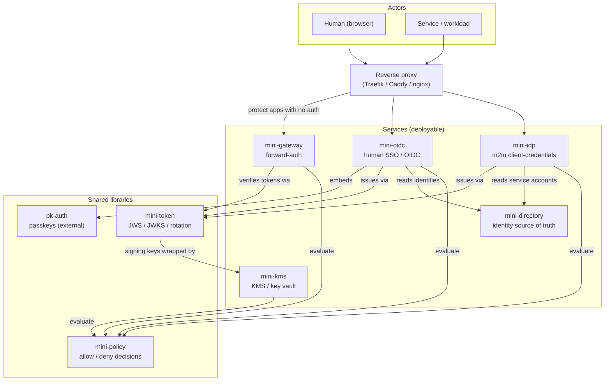

# mini-auth — Direction

This is the canonical direction document for the **mini-** family: what it is, what each
piece does, how the pieces fit together, and where it is going. If you read one file to
understand the whole, read this one.

> This is a living design doc, not an API reference. Each shipping service documents its own
> contract in its own `README.md` / OpenAPI spec; this doc is about the *whole*.

## Table of contents

- [Vision & ethos](#vision--ethos)
- [The component catalog](#the-component-catalog)
- [System architecture](#system-architecture)
- [Runtime relationships (what the names don't show)](#runtime-relationships)
- [Open design decision: the client registry](#open-design-decision-the-client-registry)
- [Toward a mini-common library](#toward-a-mini-common-library)
- [Roadmap](#roadmap)
- [Build aggregation](#build-aggregation)

---

## Vision & ethos

mini-auth is the umbrella for a family of small auth/identity services built in the same
spirit as **mini-kms** and **mini-idp**: **educational, but homelab-functional.** The code is
meant to be *read* — heavily commented, JDK-first, real-but-un-audited crypto — and at the same
time actually run a small self-hosted setup.

The guiding principle is **many small, single-responsibility libraries composed into a few
deployable services.** A "mini" is either a *library* (a focused piece of machinery: a token
plane, a policy decision function) or a *service* (a deployable front door: an OpenID Provider,
a forward-auth gateway). Services are thin; they wire libraries together and add a transport.

mini-auth itself does **not re-implement** what mini-kms and mini-idp already do. It is two
things:

1. **An aggregator build** — a single `./gradlew build` that builds the whole family, existing
   services included, in place.
2. **This direction doc** — the shared map the individual repos can't carry on their own.

The values inherited from the existing repos are non-negotiable across the family:

- **`core` stays I/O-free.** Crypto and domain logic never import a transport.
- **No oracles, no secret leakage.** Auth failures collapse to one generic error; secrets,
  keys, and bodies are never logged.
- **Secrets via env/file, never argv.** Constant-time comparisons. At-rest files `0600`,
  written atomically.
- **Loopback by default.** Exposing anything beyond loopback is an explicit operator decision.
- **One toolchain.** JDK 21, Kotlin-DSL Gradle, and one shared version catalog — the same
  **Jackson 3.x** (`tools.jackson.*`), Bouncy Castle, and JUnit versions everywhere.

---

## The component catalog

Every mini, its one-line purpose, whether it is a library or a service, and its status.

| Mini | Purpose | Type | Status |
| --- | --- | --- | --- |
| **mini-kms** | Envelope encryption / KMS: rotatable keys, the eventual vault that wraps other services' signing keys. | service (+ core/client libs) | **shipping** |
| **mini-idp** | Machine-to-machine identity: OAuth2 client-credentials → Ed25519 JWT, JWKS. | service (+ core lib) | **shipping** |
| **mini-token** | The shared token plane: JWS, JWKS, signing-key lifecycle, rotation, revocation, audit, the `grants` claim contract, and a small persistence SPI. Extracted from mini-idp; mini-idp now consumes it. | library | **shipping** |
| **mini-policy** | Generalized authorization decision function: `(principal, resource, action) → allow/deny`. Generalizes mini-kms's `KeyAuthorizationPolicy`. | library | **scaffolded** |
| **mini-oidc** | Human SSO / OpenID Provider: authorization-code + PKCE, ID + access tokens, browser SSO sessions, login/consent UI. Uses **pk-auth** for the passkey credential layer. | service | **scaffolded** |
| **mini-gateway** | Forward-auth endpoint for a reverse proxy (Traefik / Caddy / nginx `auth_request`) to gate apps with no native auth. | service | **scaffolded** |
| **mini-directory** | The single identity source of truth: users, groups, roles, service accounts, and their grant mappings. | service | **scaffolded** |
| **pk-auth** | Passkeys-first auth library set, published on Maven Central under `com.codeheadsystems`. Consumed as a normal dependency — **not vendored**. | external library | **shipping (external)** |
| **mini-ca** | Small internal certificate authority for mTLS between the minis and workload identity in the homelab. | service (future) | **roadmap** (placeholder module) |
| **mini-console** | Optional unified admin UI over the family. | service (future) | **roadmap** (placeholder module) |

"Scaffolded" means: a correct module that **compiles and passes a trivial test**, with the real
protocol/crypto left as clearly-marked TODOs at the seams. It is deliberately *not* a half-built
service that looks finished.

---

## System architecture

Two kinds of actor reach the family through a reverse proxy; services lean on the shared
libraries; the libraries lean (recursively) on mini-kms.



- **Actors → reverse proxy.** Humans arrive with a browser; services arrive with client
  credentials. The proxy is the single ingress.
- **Reverse proxy → services.** The proxy routes login to mini-oidc, token issuance to mini-idp,
  and — for apps that have *no* auth of their own — defers the allow/deny to mini-gateway via a
  forward-auth subrequest.
- **Services → shared libraries.** Services are thin compositions over the libraries.
- **Libraries → mini-kms.** The token plane's signing keys are ultimately wrapped by mini-kms,
  closing the loop.

---

## Runtime relationships

The names alone don't reveal how the pieces actually depend on each other at runtime. These are
the load-bearing relationships:

- **mini-oidc embeds pk-auth.** The passkey registration/login ceremonies are *not* re-invented;
  mini-oidc depends on `com.codeheadsystems:pk-auth-core` from Maven Central and drives it as its
  credential layer. pk-auth is never vendored into this repo.
- **mini-oidc and mini-idp both issue through mini-token.** Two different front doors — humans vs.
  machines — but **one** token plane underneath: the same JWS issuance, the same JWKS publication,
  the same signing-key rotation/revocation/audit. mini-token is the extraction of the machinery
  mini-idp wrote first, so the two issuers stop diverging.
- **All services evaluate through mini-policy.** mini-gateway gating a route, mini-kms gating a
  key group, the issuers checking a scope — each becomes a `PolicyRequest(principal, resource,
  action)` against one engine. mini-policy is the generalization of mini-kms's
  `KeyAuthorizationPolicy`.
- **mini-token's signing keys are wrapped by mini-kms (the recursive integration).** Today
  mini-idp stores its Ed25519 private key locally (`0600`) and flags that "a real deployment would
  wrap it under a KMS." mini-kms *is* that KMS. So the token plane that issues identity tokens has
  its own signing keys protected by another mini — the family secures itself. This is the single
  most important relationship in the design, and the reason mini-kms is described as "the eventual
  vault that wraps other services' signing keys."
- **mini-directory is the identity source of truth that mini-oidc and mini-idp read.** Instead of
  each issuer keeping a private registry, both resolve principals and grants from mini-directory:
  mini-oidc resolves human users, mini-idp resolves service accounts. The grants it stores are the
  data mini-policy decisions are evaluated against.

The claim payload already lines up across the family. A mini-idp token's `grants` claim maps
directly onto mini-kms's authorization model (`sub → Principal.id`, `grants.control →
Principal.admin`, `grants.groups[] → KeyAuthorizationPolicy`). mini-token preserves that mapping;
mini-policy is where it is evaluated; mini-directory is where the grants originate.

---

## Open design decision: the client registry

mini-idp owns a **client registry** today: registered OAuth clients, their Argon2id-hashed
secrets, and their grants, in its own JSON store. mini-directory is meant to be the single source
of truth for *all* identities — including **service accounts**, which is essentially what an
mini-idp OAuth client *is*.

**The open question:** should mini-idp's client registry fold into mini-directory later?

- **For folding in.** One identity model, one place to manage grants, no drift between "a service
  account" and "an OAuth client." mini-idp becomes a pure token issuer reading from mini-directory,
  matching how mini-oidc is intended to read human users from it.
- **Against (or: not yet).** mini-idp is *shipping* and self-contained; its registry doubles as
  its credential store (hashed secrets), which is issuer-specific concern, not directory data.
  Coupling a working service to a still-scaffolded one is a regression risk. The token *claim*
  contract already aligns regardless of where the data lives, so there is no urgency.

**Current lean:** keep mini-idp's registry in place while mini-directory matures, and treat the
directory's service-account model as the eventual home for the *grant mappings* first, with the
*credential* (hashed secret) possibly staying in the issuer. Revisit once mini-directory has a
real read API. This decision is deliberately left open and recorded here rather than pre-committed
in code.

---

## Toward a `mini-common` library

The two shipping services were written independently, so they each grew their own copy of the same
small security primitives. Now that they are co-built, those copies are genuine duplication and a
natural future **`libs/mini-common`** (an I/O-free foundation library both `core`s would depend on).
This is a **catalogue, not a commitment** — the code is intentionally **left in place for now**.
Extraction is its own behavior-preserving step (likely folded into Phase 1, alongside mini-token),
done only with tests pinning the behavior first.

The concrete candidates found across mini-kms and mini-idp:

| Candidate | mini-kms | mini-idp | Notes / risk |
| --- | --- | --- | --- |
| **Argon2id KDF + params** | `master/Argon2KeyDeriver`, `master/Argon2Settings` | `secret/Argon2SecretHasher`, `secret/Argon2Settings` | Two near-identical `Argon2Settings`. **But** the use differs — mini-kms derives a *key* from a passphrase, mini-idp *hashes/verifies* a secret — so extract the settings + Bc wiring, keep the two call sites' intent. |
| **Atomic `0600` JSON store** | `keyring/Keystore` | `store/JsonStore` | Same temp-file → `ATOMIC_MOVE` → `0600` (POSIX perms) write pattern. The cleanest, highest-value extraction; mini-kms layers an HMAC over metadata (`KeystoreIntegrity`) on top — keep that service-specific. |
| **base64url codec** | inline in `protocol/*`, `keyring/*` | `token/Base64Url` (dedicated) | mini-idp already has the standalone util; mini-kms open-codes `Base64.getUrlEncoder().withoutPadding()` in several places. Promote mini-idp's `Base64Url`. |
| **Constant-time compare** | `auth/ApiTokenAuthenticator`, `keyring/KeystoreIntegrity` | `server/AdminAuthenticator`, `secret/Argon2SecretHasher` | All wrap `MessageDigest.isEqual`. Trivial to share; low risk. |
| **ServerConfig env/file secret resolution** | `server/ServerConfig` (`resolveToken`, `readPassphrase`) | `server/ServerConfig` (`resolveAdminToken`) | The "secret from env var or file, never argv; loopback bind by default; port parsing" pattern. Shape is shared; the exact var names are service-specific, so extract the *mechanism*, parameterized by var name. |
| **Secure random identifiers** | nonce/id generation in `crypto/*` | `util/RandomIds` | Both lean on `SecureRandom` for ids/nonces; a tiny shared helper would remove a second copy. Lowest priority. |

Why not extract now: mini-idp and mini-kms are both **shipping**, the duplication is small and
stable, and a premature shared base risks coupling two working services to a still-moving API. The
ethos ("small, single-responsibility, readable") is better served by extracting these *with* the
mini-token work, when there is a clear second consumer and tests to lean on.

---

## Roadmap

Phased, each phase building on a green umbrella build. Earlier phases unblock later ones.

**Phase 0 — Umbrella (done).** A single unified monorepo build: mini-kms + mini-idp pulled in from
their two formerly-independent builds and regrouped under `services/` and `libs/`, behind one
wrapper, one version catalog, one set of `build-logic` convention plugins, and one CI workflow.
Every new service and library is scaffolded to compile + pass a trivial test; this direction doc
exists.

**Phase 1 — Extract the token plane (and the shared foundation).** *Token plane: done.* mini-idp's
JWS/JWKS/rotation/revocation/audit — plus the Ed25519 keys, the `grants` claim contract, the auth
model the claim maps onto (`Authorization`/`Grant`/`KeyOperation`), `Base64Url`, and `RandomIds` —
were lifted into **mini-token**, and mini-idp re-points at it with no contract change (the HTTP
endpoints, token claims, JWKS output, on-disk JSON shapes, and the single-`invalid_client`
no-oracle behavior are byte-for-byte identical, pinned by mini-idp's existing tests). Persistence is
now a small `store/DocumentStore` SPI in mini-token; mini-idp's atomic-`0600` `JsonStore` implements
it. The remaining [`mini-common` candidates](#toward-a-mini-common-library) (Argon2 settings, the
JSON store itself, constant-time compare) are deliberately **left in mini-idp** for now — the token
extraction only promoted `Base64Url`/`RandomIds`, which it directly needed; the rest waits for a
clear second consumer to pin them against.

**Phase 2 — Generalize authorization.** Flesh out **mini-policy** into a real engine and adopt it
behind mini-kms's `KeyAuthorizationPolicy` seam first (it already has the right shape), then behind
the issuers' scope checks.

**Phase 3 — Stand up the directory.** Give **mini-directory** a real identity model (users, groups,
roles, service accounts) and a read API; begin resolving grants from it (see the open question
above).

**Phase 4 — Human SSO.** Build **mini-oidc**: auth-code + PKCE, ID/access tokens via mini-token,
SSO sessions, login/consent UI, passkeys via pk-auth, users from mini-directory.

**Phase 5 — Gate everything.** Build **mini-gateway**: a forward-auth endpoint for the reverse
proxy, verifying tokens via mini-token and deciding via mini-policy, redirecting browsers to
mini-oidc.

**Phase 6 — Close the recursive loop.** Wrap mini-token's signing keys under **mini-kms** so no
private signing key sits in plaintext on disk anywhere in the family.

**Future tracks (explicitly not scheduled):**

- **mini-ca** — an internal certificate authority for mTLS between the minis and for workload
  identity in the homelab. A placeholder module exists; no logic yet.
- **mini-console** — an optional unified admin UI over the family (directory, key rotation, audit,
  KMS key groups). A placeholder module exists; no logic yet.

---

## Build aggregation

mini-auth is a single **monorepo** Gradle build. Modules are grouped by role — `services/` for the
deployable front doors, `libs/` for the shared libraries — and the Gradle project path follows the
directory, so `settings.gradle.kts` includes them as:

```kotlin
include("services:mini-kms:core"); include("services:mini-kms:server"); include("services:mini-kms:client")
include("services:mini-idp:core"); include("services:mini-idp:server")
include("services:mini-oidc"); include("services:mini-gateway"); include("services:mini-directory")
include("services:mini-ca"); include("services:mini-console")      // roadmap placeholders
include("libs:mini-token"); include("libs:mini-policy")
```

`include("services:mini-kms:core")` maps to the directory `services/mini-kms/core` and auto-creates
the (empty, inert) grouping projects `:services` and `:services:mini-kms`. Leaf names repeat across
groups (`:services:mini-kms:core` and `:services:mini-idp:core`) — Gradle keys on the full path, so
that is fine. One `./gradlew build` compiles and tests the whole family with no composite or
submodule machinery.

**One wrapper, one toolchain, convention plugins (not `subprojects {}`).** There is a single Gradle
wrapper at the root (the per-module wrappers the two minis shipped as independent repos are gone),
one `gradle/libs.versions.toml`, and the shared Java conventions live in a small **`build-logic`**
included build — `pluginManagement { includeBuild("build-logic") }` in settings. It exposes three
precompiled script plugins, applied per-module by id:

- `miniauth.java-conventions` — Maven Central, the pinned JDK 21 toolchain, JUnit 5 + the common
  test stack (jupiter + launcher), and the `-parameters` flag Jackson record binding relies on.
- `miniauth.library-conventions` — the above + `java-library` (the I/O-free `core`s, mini-token,
  mini-policy, the placeholders).
- `miniauth.application-conventions` — the above + `application` (the runnable services).

Applying the conventions per-module (instead of a root `subprojects {}` block) keeps the empty
grouping projects inert and makes each module's library-vs-service contract explicit in its own
build file. The base packages (`com.codeheadsystems.minikms` / `.miniidp` / …) were **not** changed
by the regrouping. A single CI workflow (`.github/workflows/build.yml`) runs `./gradlew build` on
every push and pull request — there is no separate lint step, because the family deliberately ships
no extra linter/formatter; the build is the gate.

> Build-script gotcha worth knowing: **never put backticks in a comment that precedes a `plugins {}`
> block** in a `*.gradle.kts` file. Gradle's lightweight prescan of the plugins block can be
> derailed by backtick-quoted text in that comment, and the plugin then silently fails to apply.

**Why a monorepo (not the earlier composite).** An earlier iteration used a Gradle composite that
`includeBuild`-referenced the sibling repos in place. Pulling the source in instead makes the
family a single versioned unit with one settings file, one version catalog, and one toolchain — the
right shape once the goal became standardizing the whole family (e.g. on Jackson 3.x) rather than
just co-building independent repos. The trade-off accepted: the vendored modules no longer carry
their own git history here, and the standalone sibling repos (if kept) must be synced manually.

**Jackson 3.x migration.** Pulling the minis in was paired with moving the family to Jackson 3.x
(`tools.jackson.*`), which is what pk-auth already uses transitively — so the whole runtime shares
one Jackson major version. The migration was mechanical but real:

- Coordinates moved to the `tools.jackson` group (`tools.jackson.core:jackson-databind`,
  `tools.jackson.dataformat:jackson-dataformat-yaml`); only `jackson-annotations` stayed on
  `com.fasterxml.jackson.core` (pulled in transitively), so `@JsonProperty` / `@JsonInclude` /
  `@JsonCreator` imports were left untouched.
- Packages `com.fasterxml.jackson.{databind,core,dataformat}` → `tools.jackson.*`.
- `ObjectMapper` is immutable in 3.x: the instance `enable`/`configure` mutators were removed, so
  mapper construction moved to `JsonMapper.builder()…build()`.
- Read/write methods now throw the **unchecked** `tools.jackson.core.JacksonException` instead of
  checked `JsonProcessingException` / `IOException`; `catch` blocks that wrapped pure-Jackson calls
  were updated accordingly (Jackson-and-file calls kept their `IOException` handling).
- A few `JsonNode` iteration APIs were renamed (`fieldNames()` → `properties()`).

All 134 tests across the family pass on Jackson 3.x, including the protocol codec, keystore I/O,
token issue/verify, the live JWKS integration test, and the OpenAPI contract test.

The new modules (`mini-token`, `mini-policy`, `mini-oidc`, `mini-gateway`, `mini-directory`,
`mini-ca`, `mini-console`) are members of the same build and were authored on Jackson 3.x from the
start.
